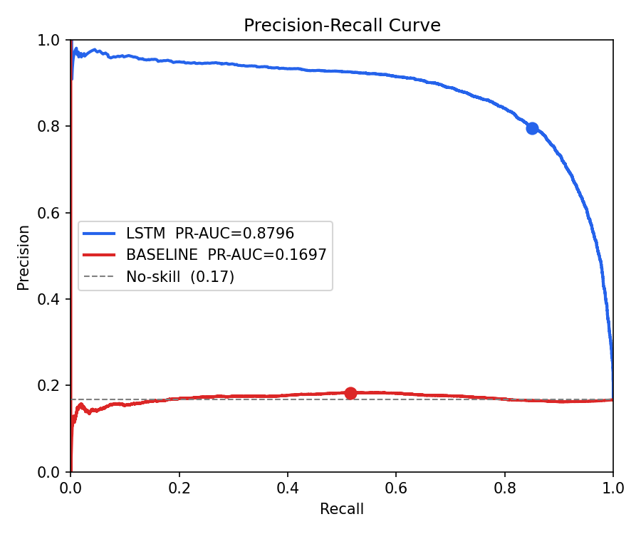
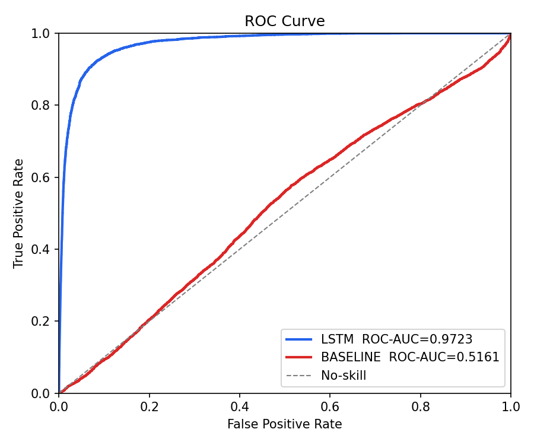
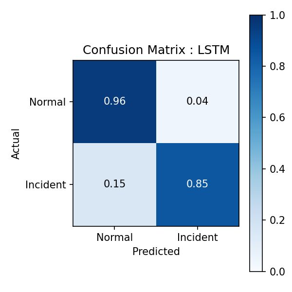
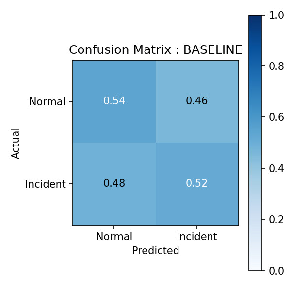
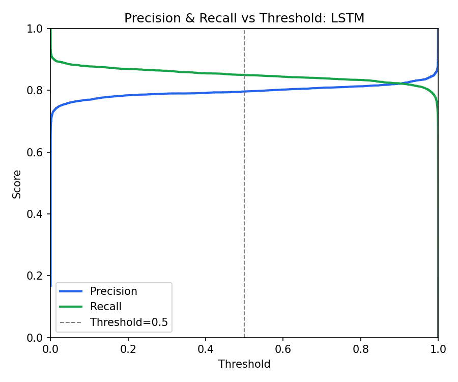

# Incident Prediction from Multivariate Time Series

Supervised binary classification over sliding windows of a multivariate time
series. Given the last 100 timesteps of an 8-channel signal, the model
predicts whether an incident will occur in the next 50 timesteps.


### Requirements

```bash
pip install numpy scikit-learn torch matplotlib
```


### How to run

#### Option 1: runner.py (recommended)

`runner.py` runs the full pipeline in order. On startup it asks whether you want
to change any of the default parameters. Press Enter to keep a value, or type
a new one.

```bash
python runner.py
```

To skip the prompts and use defaults:

```bash
python runner.py --yes
```

To pass parameters directly without being asked:

```bash
python runner.py --yes --T=50000 --normal-noise=0.20 --incident-noise=0.28
```

To skip the baseline or evaluation steps:

```bash
python runner.py --skip-baseline
python runner.py --skip-eval
```

#### Option 2: run steps manually

```bash
python data_generator.py
python baseline_logistic_regression.py
python LSTM.py
python evaluation.py
```

### CLI Arguments

These control the dataset and problem formulation. All are optional.

| Argument | Default | Description |
|---|---|---|
| `--T` | 100000 | Total timesteps in the generated signal. Larger values mean more training data but slower generation. |
| `--F` | 8 | Number of sensor channels. |
| `--W` | 100 | Input window size. How many past timesteps the model sees when making a prediction. |
| `--H` | 50 | Prediction horizon. How far ahead the model looks for an incoming incident. Larger H means more lead time but an easier label to satisfy. |
| `--normal-noise` | 0.24 | Per-channel noise standard deviation during normal operation. |
| `--incident-noise` | 0.26 | Per-channel noise standard deviation during an incident. The closer this is to `--normal-noise`, the harder the problem. |
| `--normal-shared` | 0.15 | Standard deviation of the shared component that ties channels together during normal operation. Lower values mean weaker cross-channel correlation and a harder problem. |
| `--skip-baseline` | off | Skip the logistic regression step. |
| `--skip-eval` | off | Skip the evaluation plots. |
| `-y`, `--yes` | off | Skip interactive prompts and use defaults or provided values. |

**On difficulty:** `--normal-noise`, `--incident-noise`, and `--normal-shared`
together control how hard the problem is. The defaults were found by running
`difficulty_search.py`, which searches for the tightest configuration where
the LSTM still scores above PR-AUC 0.86. If you want a harder problem, bring
`--incident-noise` closer to `--normal-noise` and reduce `--normal-shared`.


## Files

**`runner.py`**
runs the full pipeline. Handles the interactive parameter prompt, passes
values to downstream scripts, and exits if any step fails.

**`data_generator.py`**
Generates the synthetic dataset. Defines the signal, the incident placement
logic, the precursor structure, and the sliding-window formulation. Accepts
all dataset parameters via CLI.

**`difficulty_search.py`**
Runs a search over progressively harder configurations and stops when LSTM PR-AUC drops below the target. You do not need to run this to reproduce the results — it is here
to show the reasoning behind the defaults.

**`baseline_logistic_regression.py`**
Flattens each window into a vector and fits a logistic regression. No concept
of time. Included to show what happens when you ignore temporal structure and
to give the LSTM result something to compare against.

**`LSTM.py`**
The main model. Two stacked LSTM layers with dropout, trained with a weighted
loss to handle class imbalance. Handles normalization, train/val split, early
stopping, and learning rate scheduling internally.

**`evaluation.py`**
Loads saved predictions from both models and produces five plots in
`./evaluation/`. 

### Output Structure

After running all steps:

```
synthetic/
    X_train.npy
    y_train.npy
    X_test.npy
    y_test.npy
    y_true.npy
    y_prob_baseline.npy
    y_prob_lstm.npy
    lstm.pt
    meta.json

evaluation/
    pr_curve.png
    roc_curve.png
    confusion_matrix_lstm.png
    confusion_matrix_baseline.png
    pr_vs_threshold.png
```


### Results

| Model               | PR-AUC | ROC-AUC | Precision | Recall | F1   |
|---------------------|--------|---------|-----------|--------|------|
| Logistic Regression | 0.170  | 0.516   | 0.18      | 0.52   | 0.27 |
| LSTM                | 0.785  | 0.953   | 0.79      | 0.74   | 0.76 |

#### Evaluation Plots
 
Generated by `evaluation.py` and saved to `./evaluation/`.
 

 
 

 
 

 
 

 
 

